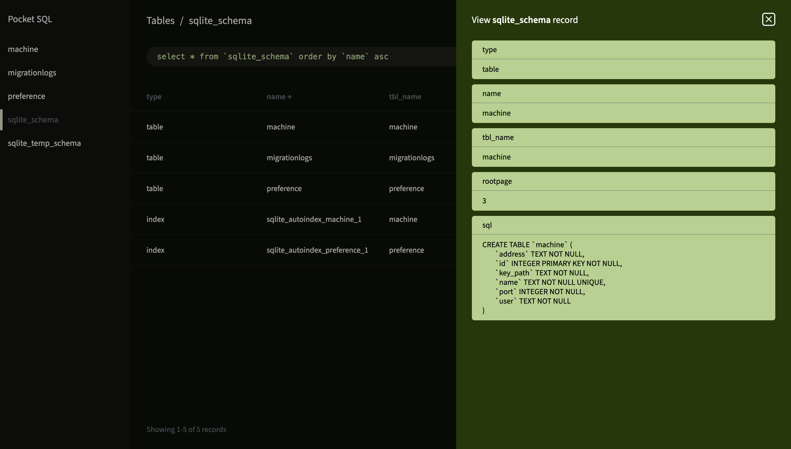

# Pocket SQL

SQLite dashboard.



## Install

Pocket SQL ships as a single binary which may be placed wherever you please, usually a directory found in the terminal `$PATH`. See the [releases](https://github.com/evantbyrne/pocketsql/releases) section of the git repository for downloads.

## Usage

```
% pocketsql open [connection]
```

Connection strings are prefixed with `sqlite3:` and the format is described in the go-sqlite3 driver [documentation](https://github.com/mattn/go-sqlite3?tab=readme-ov-file#connection-string). For example, to open a SQLite database located in `database.sqlite` with default pragmas, you would use the shell command:

```
% pocketsql open "sqlite3:file:database.sqlite"
```
